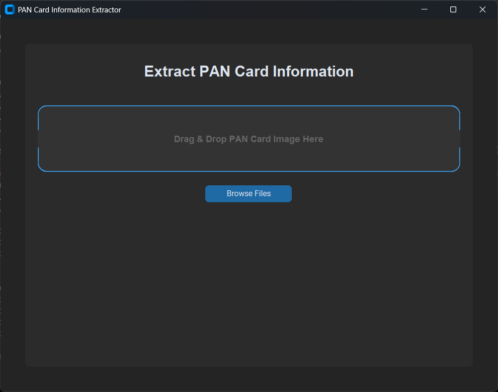
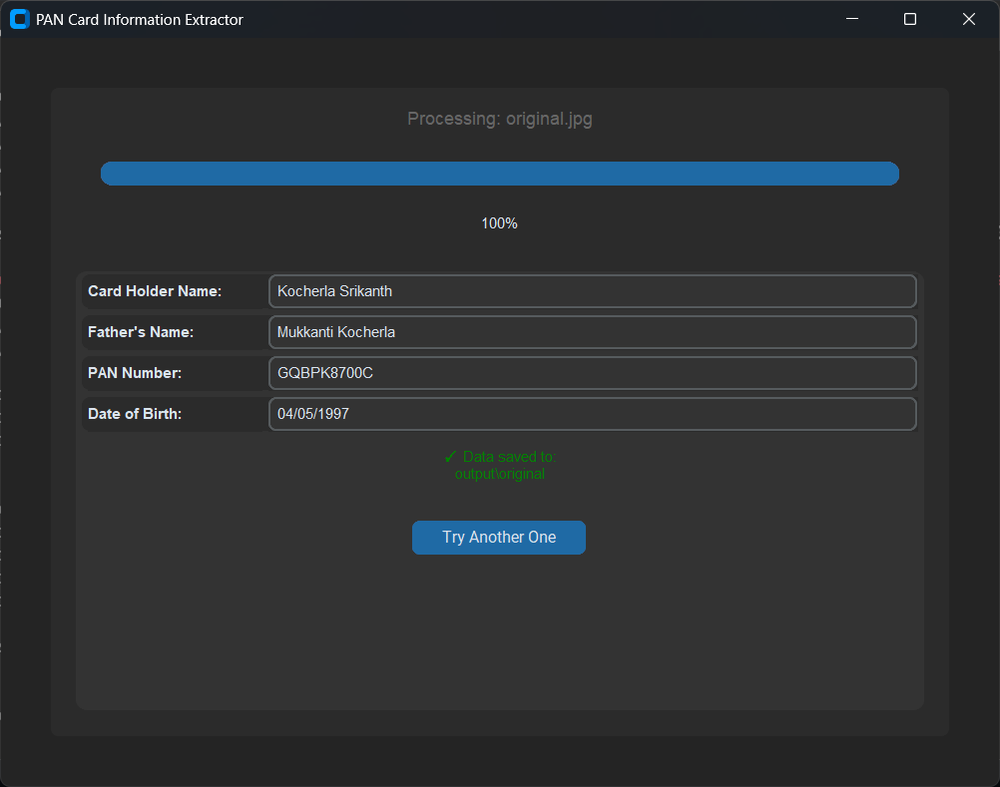
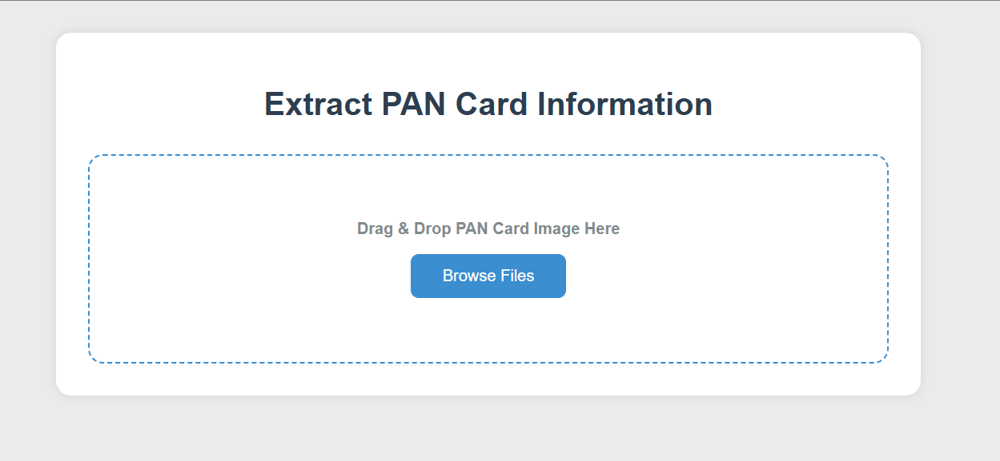
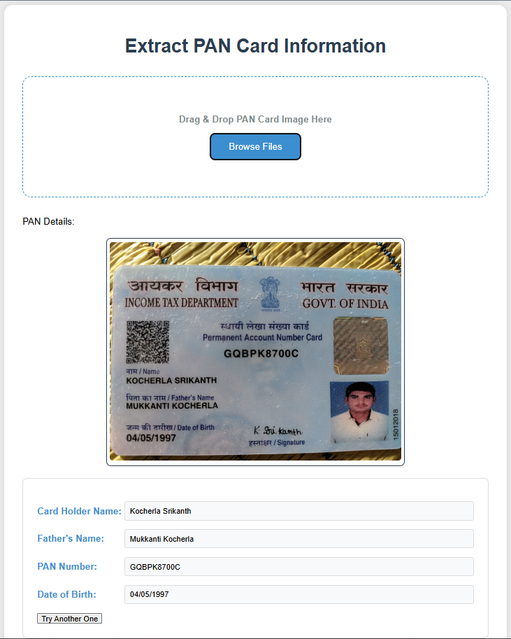

# PAN-card-Data-extractor  

This project consists of a custom-trained YOLOv8 OBB model that will detect the fields (Name, Father's Name, PAN Number, and Date of Birth) on a given image. After that with the help of Tesseract-OCR, it will extract the text from the detected boxes.  
<br>

You can extract text from PAN card in 3 different ways:  
1. With the help of CLI.   

2. With the help of GUI.  

3. With the help of Flask.   
<br>

## How To Run This Project:  

Create an Virtual Enviroment.
```
python -m venv pan
```

Install All required Libraries.
```
pip install -r requiremennts.txt
```

Download and Install Tesseract-OCR on your PC. You can download it from [here](https://github.com/tesseract-ocr/tesseract.git).  

Download the Weights of the model from [here](https://drive.google.com/file/d/1pYdpASoYBK0KDsNCPJgkVnAi4efp840j/view?usp=drive_link). Place the weights in your project root folder.  
<br>

If you want see what the model is detecting.  

Run this command.  
```
python inference.py
```

Then Give input image path and it will show the bounding box on image.  
<br>

### **1. For Extraction With the help of CLI:**  

Run this Command for getting output in Excel File.  
```
python pan_ocr.py  
```
OR Run this Command for  getting output as .JSON File. 
```
python pan_json.py
```

After that, it will ask for a path, and then give the path of your image or you can give path of the folder which contain PAN card images for batch processing.  

NOTE: Remove inverted commas.  

Voila! Your output will be saved into the pan_records.xlsx if first coammand was executed and if the second command was executed, the JSON file will be saved in output folder.  

<br>

### **2. For using GUI:**  

Run this Command 
```
pan_gui.py
```  

This is how the GUI looks like.  



After that just upload the image and Voila! Your output will be saved into the output folder, as .JSON file.  

This is how Output window look like.  



<br>

### **3. For Flask:** 

Run this Command  
```
set FLASK_APP=app.py
```  

and then run this command 
```
flask run --host=0.0.0.0 --port=5000
```  

Or directly run 
```
python -m flask run --host=0.0.0.0 --port=5000
```  

This is how the Frontend will look like.  



Now, Your project will start running on port 5000 just open the link that is present in the Command Prompt and now you can upload your image and get output.  

This will save the image you uploaded in the upload folder and .JSON file in the Output folder which contains the extracted details.  

This how Output will Look like.  



